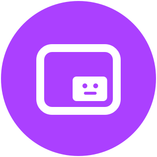

# Little Camera Preview

A Godot editor plugin that shows a picture-in-picture style preview when selecting a 2D or 3D camera.

Install via the [Asset Library](#) or [download from GitHub.](#)

## Installation

- Use **Godot 4.2 or above**
- Move the folder `addons/anthonyec.camera_preview` to your project's `addons` folder
- Enable Camera Preview in Project Settings > Addons

## Licence

Licensed under the MIT license, see [LICENSE](./LICENCE) for more information.
